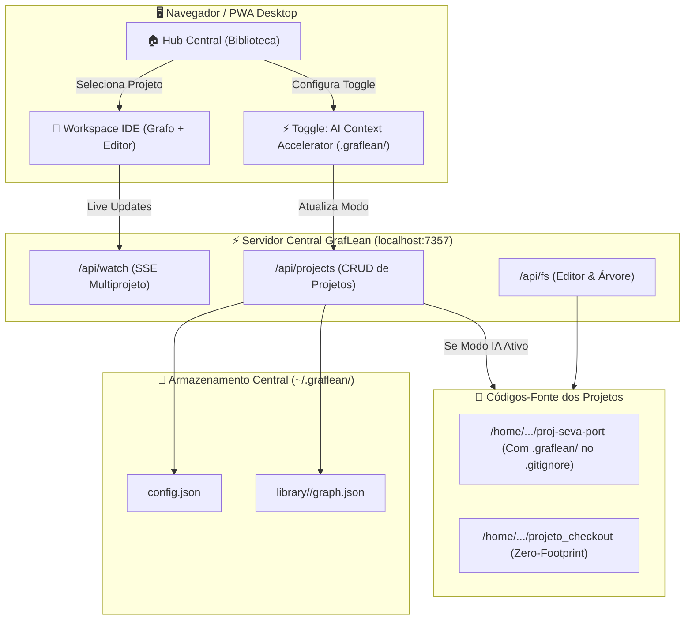

# 🏛️ Plano Arquitetural: GrafLean Workspace Hub & PWA Local

> **Evolução do GrafLean:** Transformação de CLI single-project para uma **Architecture-First IDE Centralizada**, com suporte a múltiplos projetos simultâneos, biblioteca isolada em `~/.graflean/`, interface PWA instalável no desktop e **Modo Acelerador de IA (`.graflean/`)** para redução massiva de tokens de contexto.

---

## 🎯 1. Diagnóstico e Visão do Problema

### Problema Atual:
1. **Risco de Poluição de Repositórios:** O GrafLean originalmente gerava `.arch_graph.json` e `arch_map.html` soltos na raiz do projeto analisado.
2. **Monotarefa (Single-Instance):** O servidor atual atende apenas ao projeto passado por parâmetro na inicialização (`gfwatch <dir>`).
3. **Consumo Excessivo de Tokens da IA Sem Grafo Local:** Quando um agente de IA (Antigravity, Cursor, Claude) opera em um projeto sem mapa topológico, gasta de 30k a 80k tokens lendo dezenas de arquivos apenas para descobrir "quem chama quem". Com o grafo compacto, consome menos de 3k tokens (economia de > 90%).

### Solução Arquitetural Híbrida:
1. **Armazenamento Centralizado na Biblioteca (`~/.graflean/`):**
   - Todo o cache de projetos, metadados e configurações globais fica isolado em:
     ```text
     ~/.graflean/
     ├── config.json               # Lista de projetos cadastrados e preferências
     └── library/
         ├── proj_seva_port/       # Cache e grafos do projeto Seva
         │   ├── graph.json
         │   └── metadata.json
         └── projeto_checkout/     # Cache e grafos do projeto Checkout
             ├── graph.json
             └── metadata.json
     ```
2. **Estratégia de Armazenamento Dual (Chave Seletora por Projeto):**
   - **Modo 1: Zero-Footprint (Padrão):** 100% dos dados na biblioteca central `~/.graflean/`. O projeto no disco fica completamente intocado.
   - **Modo 2: AI Context Accelerator (Otimização para Agentes de IA):**
     - O GrafLean gera uma pasta oculta padronizada na raiz do projeto:
       ```text
       meu_projeto/
       ├── .graflean/               # Pasta oculta padronizada (estilo .git, .vscode)
       │   ├── graph.json           # Topologia estrutural compacta para consumo de LLMs
       │   └── architecture.md      # Resumo executivo legível para agentes de IA
       ```
     - **Auto-.gitignore:** O GrafLean insere automaticamente `.graflean/` no `.gitignore` do projeto do usuário. O repositório sobe para o GitHub **100% puro**, enquanto a IA local economiza rios de tokens!
3. **Dashboard Central / Workspace Hub (PWA):**
   - Servidor único como daemon local em `http://localhost:7357`.
   - Rota `/`: Tela da **Biblioteca de Projetos** (Cards visuais com métricas de saúde, toggle de acelerador de IA, botão de abrir e remover).
   - Rota `/workspace/<project_id>`: O editor/grafo do GrafLean com navegação e Watch Mode dedicados.
   - Capacidade **PWA (Progressive Web App)**: Arquivo `manifest.json` e `service-worker.js` para instalar o GrafLean como aplicativo de desktop nativo na barra de tarefas do Linux.

---

## 🏗️ 2. Arquitetura do Sistema



---

## 📋 3. Funcionalidades da Interface

### A. Tela 1: A Biblioteca de Projetos (Dashboard Hub)
1. **Grid de Projetos Cadastrados:**
   - Card para cada projeto exibindo:
     - Nome e caminho absoluto.
     - Total de nós (classes/funções) e conexões.
     - Indicador de integridade arquitetural (Índice de Instabilidade médio e alerta de ciclos de dependência).
     - Data do último escaneamento.
     - **Chave Seletora:** `[x] Acelerador de IA (gerar .graflean/ local e adicionar ao .gitignore)`.
2. **Ações por Projeto:**
   - **`[🚀 Abrir Workspace]`**: Abre a IDE com o grafo e o editor do projeto selecionado.
   - **`[🔄 Re-escanear]`**: Força uma nova análise estática instantânea.
   - **`[🧹 Limpar Cache / Remover]`**: Exclui o cache da biblioteca e remove a pasta `.graflean/` local se existir.
3. **Barra Superior de Ações:**
   - Botão **`[➕ Novo Projeto]`**: Modal para colar o caminho absoluto do projeto ou selecionar a pasta.
   - Botão **`[📲 Instalar Aplicativo]`** (PWA nativo).

### B. Tela 2: O Workspace IDE (Atualizado)
- Mantém o tema Monokai Sublime True Black, o Grafo Vis.js reativo e o editor com `Ctrl+S`.
- Adicionado botão **`[◀ Biblioteca]`** no topo para voltar à lista geral de projetos instantaneamente.
- Seletor rápido de projetos (*Workspace Switcher*) na barra superior para alternar de contexto sem fechar a aba.

---

## 🛠️ 4. Roteiro de Implementação em Fases (Roadmap)

### Fase 1: Módulo Central de Armazenamento & AI Accelerator (`core/library.py`)
- Implementar `LibraryManager` para gerenciar `~/.graflean/config.json`.
- Métodos:
  - `register_project(path: str, ai_accelerator: bool = True) -> ProjectMetadata`
  - `remove_project(project_id: str, purge_local_folder: bool = True) -> bool`
  - `toggle_ai_accelerator(project_id: str, enable: bool) -> bool`
  - `sync_project_gitignore(project_path: str) -> None`
  - `list_projects() -> List[ProjectMetadata]`
  - `get_project_cache_dir(project_id: str) -> str`
- Atualizar `ProjectGraph` para salvar tanto na biblioteca central quanto na pasta oculta `.graflean/` quando habilitado.

### Fase 2: Roteamento Multiprojeto no Servidor (`core/hub_server.py`)
- Rotas do servidor unificado:
  - `GET /` -> Renderiza o Hub da Biblioteca.
  - `GET /p/<project_id>` -> Renderiza o Workspace do projeto especificado.
  - `GET /api/projects` -> Lista JSON de projetos cadastrados.
  - `POST /api/projects/add` -> Registra e indexa novo projeto.
  - `POST /api/projects/toggle-ai` -> Alterna o modo acelerador de IA.
  - `POST /api/projects/remove` -> Remove da biblioteca.
  - `GET /events/<project_id>` -> SSE dedicado para sincronização daquele projeto.

### Fase 3: Suporte a PWA (Desktop App)
- Criar `manifest.json` com ícones, nome `GrafLean IDE`, tema escuro `#1e1f1c` e modo `standalone`.
- Criar `service-worker.js` para cache dos assets estáticos (Vis.js, Highlight.js, fontes).

### Fase 4: Comandos CLI Atualizados
- `gf` ou `graflean` sem argumentos abre o **Hub Central**.
- `gf add <dir> [--no-ai]` cadastra um projeto na biblioteca.
- `gf rm <nome_ou_dir>` remove da biblioteca.
- `gfwatch [dir]` abre direto o workspace do projeto.
- `gfhelp` atualizado com os novos comandos do Hub.

---

## 🔒 5. Garantia de Qualidade e Critérios de Aceite
1. **Segurança de Repositório:** Se o modo Acelerador de IA estiver ativo, o arquivo `.gitignore` do projeto DEVE conter a entrada `.graflean/` para impedir commits acidentais.
2. **Zero-Footprint Garantido:** Se o modo Acelerador de IA estiver desativado, nenhum arquivo deve ser gravado no diretório monitorado.
3. **Persistência Segura:** Remoção de um projeto da biblioteca apaga seu cache em `~/.graflean/library/` e remove a pasta local `.graflean/` se solicitado.
4. **Testes Unitários:** Cobertura de 100% dos novos métodos em `tests/test_library.py`.
