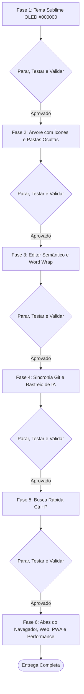

# Plano de Implementação — GrafLean: Experiência Sublime OLED & IDE Hub

Este plano estabelece a evolução visual, ergonômica e funcional do **GrafLean**, migrando a estética atual para um ambiente de foco profundo baseado em **Preto Absoluto OLED (`#000000`)** inspirado no Sublime Text do desenvolvedor, além de atender integralmente a todos os pontos levantados no documento `doc/novo_arquivo.md`.

---

## 🎯 Objetivo Geral
Transformar o GrafLean em uma IDE/Hub de arquitetura com latência ultra-baixa (< 15ms), estética premium focada em concentração de longas horas (*True Black OLED* com acentos Monokai vibrantes de alto contraste), árvore de arquivos completa com ícones temáticos e pastas ocultas, editor semântico com quebra de linha que não perde o destaque ao editar, rastreador em tempo real de alterações feitas por IAs, atalho de busca rápida universal (`Ctrl+P`) e **preservação total das abas do próprio navegador** para navegação simultânea na internet, pesquisas, chamadas a IAs web e múltiplos workspaces.

---

## 🔍 Diagnóstico e Análise do Contexto Atual

1. **Paleta Atual:** O projeto atualmente utiliza a paleta Catppuccin Mocha (`#11111b`, `#89b4fa`), que possui tons azulados/cinzentos que dispersam a luz em telas escuras. O objetivo é a migração para o **Preto Absoluto (`#000000`)** com acentos Monokai clássicos (`#f92672`, `#66d9ef`, `#e6db74`, `#fd971f`, `#a6e22e`).
2. **Editor de Código:** Na visualização, o `highlight.js` colore o código. No entanto, ao entrar em modo de edição (`toggleEditMode`), a tabela é ocultada e substituída por uma `<textarea>` de texto puro desformatada, perdendo a semântica do código. Além disso, falta quebra de linha automática (*word wrap*).
3. **Árvore de Arquivos:** Pastas como `.idea`, `.docs`, `.gemini` são filtradas por regras em `core/tree.py` (`ignoreddirs` e `startswith(".")`). Faltam ícones temáticos por extensão de arquivo.
4. **Git Tracker:** O `core/git_tracker.py` já captura status do Git, mas a interface precisa de sincronia contínua e destaque imediato para arquivos gerados ou alterados por agentes de IA.
5. **Busca Rápida:** Falta um comando rápido estilo Sublime Text (`Ctrl+P` / Goto Anything) para salto instantâneo de arquivo.
6. **Modo de Janela e Abas do Navegador:** O script `run_app.sh` usa a flag `--app="$URL"`, que força o Chrome a ocultar a barra de abas nativa e a barra de endereços. Isso impede que o desenvolvedor abra novas abas do próprio navegador para pesquisar no Google/StackOverflow, acessar IAs na web ou manter outros workspaces lado a lado.

---

## 🚦 Fases de Execução com Pontos de Parada, Teste e Validação

---

### Fase 1: Identidade Visual Monokai OLED (`#000000`) & Concentração
**Objetivo:** Eliminar todos os tons acinzentados/azulados lavados da interface e aplicar a paleta Monokai OLED pura, com acabamento glassmorphic discreto apenas em superfícies flutuantes (menus/modais).

- **Arquivos Envolvidos:**
  - `core/visualizer.py`
  - `core/hub_server.py`
- **Alterações:**
  - `background-color` principal: `#000000` (Canvas, Sidebar, Viewport do código, Dashboard).
  - Painéis secundários: `#080808` / `#0d0d0d` com bordas sutis `1px solid rgba(255, 255, 255, 0.07)`.
  - Acentos de texto:
    - Palavras-chave: Rosa `#f92672`
    - Tipos/Classes: Ciano `#66d9ef`
    - Strings: Amarelo `#e6db74`
    - Variáveis/Parâmetros: Âmbar/Laranja `#fd971f`
    - Funções: Verde `#a6e22e`
    - Gutter / Linhas / Inativos: Cinza grafite `#555555` e `#75715e`
- **🛑 Ponto de Parada, Teste e Validação:**
  1. Iniciar o servidor local via `python3 lens.py hub --no-browser` e abrir no navegador.
  2. Verificar visualmente se o fundo da Sidebar e do Editor é preto absoluto (`#000000`).
  3. Confirmar com o Hermann se o conforto visual e o contraste estão idênticos ao seu Sublime Text.

---

### Fase 2: Árvore de Arquivos com Ícones Temáticos e Pastas de Configuração
**Objetivo:** Permitir visualização de pastas como `.idea`, `.docs`, `.gemini`, pastas com ponto configuradas pelo usuário, e exibir ícones coloridos característicos para cada tipo de arquivo.

- **Arquivos Envolvidos:**
  - `core/tree.py`
  - `core/visualizer.py`
  - `tests/test_tree.py`
- **Alterações:**
  - Em `core/tree.py`: Manter na lista de bloqueio apenas diretórios binários e massivos (`.git`, `node_modules`, `vendor`, `__pycache__`). Liberar a exploração de pastas como `.idea`, `.docs`, `.gemini`, `.github`.
  - Em `core/visualizer.py`: Mapear ícones SVG/Unicode temáticos específicos na renderização da árvore (PHP, Python, JS/TS, Markdown, HTML, CSS, JSON, YAML, Shell, `.env`, etc.).
- **🛑 Ponto de Parada, Teste e Validação:**
  1. Executar bateria de testes: `python3 -m unittest tests/test_tree.py`.
  2. Abrir o projeto no navegador e verificar se a pasta `.idea` e `.docs` aparecem normalmente na árvore.
  3. Validar se os ícones dos arquivos correspondem aos tipos com legibilidade e estética elegante.

---

### Fase 3: Editor Semântico em Modo Edição & Quebra de Linha Automática (*Word Wrap*)
**Objetivo:** Resolver a perda de semântica (código virando texto plano ao clicar em Editar) e adicionar quebra de linha automática.

- **Arquivos Envolvidos:**
  - `core/visualizer.py`
  - `tests/test_visualizer.py`
- **Alterações:**
  - Ativar `white-space: pre-wrap; word-break: break-word;` no visualizador e no editor de código.
  - Adicionar suporte a syntax highlighting para `.sh` (bash/shell) e `.yaml` / `.yml`.
  - Integrar um motor de edição semântica leve (CodeMirror com tema Monokai OLED carregado via CDN assíncrono/lazy, pesando menos de 100KB) ou editor overlay reativo que preserve cores durante a edição direta do arquivo.
  - Manter suporte ao salvamento direto no disco (`Ctrl+S`) com validação de permissões e feedback instantâneo via toast.
- **🛑 Ponto de Parada, Teste e Validação:**
  1. Executar testes de visualização: `python3 -m unittest tests/test_visualizer.py`.
  2. Abrir um arquivo PHP e um arquivo Shell no GrafLean.
  3. Clicar em "Editar" (ou pressionar atalho), digitar novas linhas de código e comprovar que as cores da sintaxe permanecem ativas.
  4. Testar a quebra de linha em linhas extensas sem barra de rolagem horizontal desnecessária.

---

### Fase 4: Sincronização em Tempo Real de Arquivos da IA e Status Git
**Objetivo:** Identificar e sinalizar instantaneamente arquivos criados (`NOVO` em verde) ou alterados (`MOD` em âmbar) por agentes de IA ou ferramentas externas.

- **Arquivos Envolvidos:**
  - `core/git_tracker.py`
  - `core/watcher.py`
  - `core/visualizer.py`
  - `tests/test_git_tracker.py`
- **Alterações:**
  - Garantir que o `Watcher` dispare checagens do `GitTracker` a cada evento de `file_created` ou `file_modified`.
  - Atualizar os nós do grafo e a árvore de arquivos dinamicamente via WebSocket / SSE ou polling leve sem recarregar a página.
  - Exibir distintivo visual na árvore e no grafo:
    - 🟢 `NOVO`: Arquivo novo não rastreado ou adicionado no Git.
    - 🟡 `MOD`: Arquivo com modificações de conteúdo não commitadas.
- **🛑 Ponto de Parada, Teste e Validação:**
  1. Executar testes: `python3 -m unittest tests/test_git_tracker.py tests/test_watcher.py`.
  2. Criar um novo arquivo de teste via terminal e verificar se o GrafLean adiciona a tag `NOVO` instantaneamente sem F5.
  3. Editar um arquivo existente e verificar se ele ganha a tag `MOD`.

---

### Fase 5: Busca Rápida de Arquivos e Símbolos (Estilo Sublime `Ctrl+P`)
**Objetivo:** Permitir busca ultra-rápida por arquivos e símbolos com navegação pelo teclado.

- **Arquivos Envolvidos:**
  - `core/visualizer.py`
- **Alterações:**
  - Adicionar modal flutuante centralizado estilo *Command Palette* do Sublime Text acionado por `Ctrl+P` (ou `Cmd+P`).
  - Algoritmo de busca fuzzy em memória sobre o índice de arquivos e nós já carregados no client-side ($O(1)$ a $O(N)$ em memória, sem I/O de disco).
  - Suporte a navegação por setas (`↑` e `↓`) e tecla `Enter` para salto direto ao arquivo e linha selecionados.
- **🛑 Ponto de Parada, Teste e Validação:**
  1. Pressionar `Ctrl+P` na interface.
  2. Digitar caracteres parciais (ex.: `tok` para localizar `EmailVerificationToken.php`).
  3. Navegar com o teclado e dar `Enter` para confirmar que o editor abre imediatamente o arquivo correto.

---

### Fase 6: Preservação das Abas Nativas do Navegador, Multi-Workspace, Web & Performance ("Fazer a IDE Voar")
**Objetivo:** Eliminar o bloqueio das abas do navegador provocado pelo modo `--app`, permitindo navegar na internet, pesquisar documentações, abrir IAs online e gerenciar múltiplos workspaces na mesma janela, mantendo Lazy Loading e tempo de carregamento ultra-rápido.

- **Arquivos Envolvidos:**
  - `run_app.sh`
  - `core/visualizer.py`
  - Suíte completa de testes (`python3 -m unittest discover tests`)
- **Alterações:**
  - **Ajuste no Launcher (`run_app.sh`):** Substituir a flag restritiva `--app="$URL"` por `--new-window "$URL"` (ou disponibilizar flag configurável `--tabs` / `--window`), preservando as **abas nativas do próprio navegador** (`Ctrl+T`), barra de navegação e atalhos completos. Assim, o desenvolvedor pode abrir uma aba para o GrafLean, uma aba para o ChatGPT/Gemini/Claude web, abas de pesquisa no Google/StackOverflow e dividir a tela livremente.
  - **Múltiplos Workspaces em Abas:** Permitir que cada projeto cadastrado no Hub possa ser aberto diretamente em uma nova aba do navegador com `Ctrl+Click` ou botão dedicado "Abrir em Nova Aba".
  - **Abas Internas no Editor:** Suporte a abas de arquivos dentro do próprio GrafLean para alternar rapidamente entre código sem perder a posição de rolagem.
  - **Lazy Loading e Otimização:** Carregamento sob demanda (*lazy fetch*) para conteúdos pesados, garantindo que o carregamento inicial ocorra em menos de 15ms.
- **🛑 Ponto de Parada, Teste e Validação:**
  1. Executar `./run_app.sh` e confirmar que o Chrome abre com a barra de abas ativa.
  2. Abrir uma nova aba do navegador com `Ctrl+T`, navegar em um site externo (ex.: documentação ou IA web) e verificar a convivência perfeita com o GrafLean.
  3. Executar a suíte completa de testes: `python3 -m unittest discover tests` (garantindo 100% dos 63 testes passando).

---

## 🛡️ Estratégia de Qualidade e Segurança
- **Não-Regressão:** Toda modificação em arquivos do `core/` será acompanhada da execução prévia e posterior da suíte de testes existente (`63 testes`).
- **Clean Architecture:** O `core/` permanece sem dependências externas de pacotes Python; todas as extensões visuais e utilitários de sintaxe operam no client-side e nas rotas dedicadas de apresentação.
- **Protocolo de Confirmação:** Nenhuma linha de código de produção será alterada sem a apresentação antecipada dos `diffs` e a aprovação do Hermann a cada fase.
